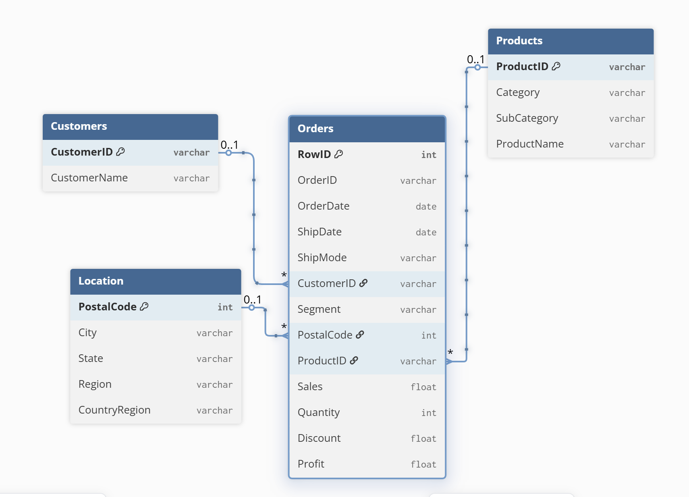

  

<h1 align="center">Order Behavior Report</h1>

# Executive Summary

### Sales & Profit Overview (2020–2023)

  

-----

### ❗ Main Business Problem

This project analyzes three key business challenges:

1. **Are we growing in a healthy way?**  
   Quantity and sales are increasing, but it is unclear whether profit is keeping pace or being eroded by discounts and low-margin products.

2. **Which categories and sub-categories are really driving or hurting performance?**  
   Management needs to identify the top profit drivers and the underperforming segments to focus marketing, pricing and assortment decisions.

3. **How stable is demand across regions and time?**  
   Volatile trends in some product groups make inventory planning difficult and may lead to stockouts in high-growth items and overstock in declining ones.

   ### Entity-Relationship Diagram

  

  

  Looking at the full historical trend and focusing on 2023:

1. **Strong growth in 2023**
   - Total Sales in 2023 reached **$733.2K**, with a **+20.36%** increase vs. the previous year.
   - Total Profit was **$93.4K**, up **+14.24% YoY**.
   - Total Quantity sold was **12.5K units**, growing **+26.83% YoY**.

2. **Seasonality and year-end uplift**
   - Monthly trends for Sales, Profit, and Quantity show a clear build-up from the first half of the year toward **stronger performance in Q4**.
   - The dashboard highlights how seasonality affects both demand (Quantity) and profitability.

3. **Healthy but slightly pressured profitability**
   - While Sales and Quantity grew faster than Profit, the gap suggests **margin pressure**, likely due to higher discounts or a shift to lower-margin products in some months.

4. **Actionable takeaways**
   - 2023 was a growth year overall, but monitoring **profit margins** and **discount behavior** is critical to sustain healthy profitability while continuing to scale sales volume.

  

### 💰 Profit by Category – Insights

- Total profit for the period is **$81,795**.  
- **Technology** is the main profit driver with **$39,774 (~49%)** of total profit.  
- **Office Supplies** contributes **$35,061 (~43%)**, providing a strong and stable second pillar.  
- **Furniture** generates only **$6,960 (~8%)**, highlighting a category that may need optimization in pricing, product mix, or discount strategy.

  

### 🔍 Sub-Category Insights

- Strong profit growth in **Appliances, Binders, Phones, Storage and Labels** indicates these sub-categories are key drivers of overall performance.  
- **Envelopes, Fasteners and Machines** show negative YoY change, suggesting issues in pricing, discounting or weakening demand.  
- Extreme swings in **Tables** and **Bookcases** highlight high volatility and the need for closer monitoring of stock levels and margins.  
- Focusing marketing and inventory efforts on the top-growing sub-categories while reviewing the underperformers can significantly improve total profitability.

  

### 📦 Quantity Trend Insights

- Total quantity reached **12.5K units**, a strong **+26.83%** increase vs. previous year.  
- The year starts at a relatively low level (~**363 units** in January) and then builds steadily through the middle of the year.  
- A sharp uplift in **Q4** shows the highest monthly quantities (peaking around **1,840 units**), indicating strong end-of-year demand.  
- The overall pattern suggests growing market traction, with volume expansion being a key driver of top-line growth.

## ✅ Results & Business Recommendations

### 1. Key Results

- **Strong top-line growth in 2023**  
  - Total Sales reached **$733.2K** (**+20.36% vs PY**).  
  - Total Profit reached **$93.4K** (**+14.24% vs PY**).  
  - Total Quantity reached **12.5K units** (**+26.83% vs PY**).

- **Profit is concentrated in a few categories**  
  - **Technology** and **Office Supplies** generate the majority of profit (~92% combined).  
  - **Furniture** contributes only a small share and shows weaker performance.

- **Sub-Category performance is highly uneven**  
  - Strong YoY growth in **Appliances, Binders, Phones, Storage and Labels**.  
  - Negative or weak trends in **Envelopes, Fasteners, Machines** and some Furniture lines (e.g., Tables, Bookcases).

- **Seasonality and volatility impact planning**  
  - Demand accelerates towards **Q4**, with noticeable spikes in quantity.  
  - Some sub-categories show sharp swings, increasing inventory and margin risk.

---

### 2. Business Recommendations

1. **Double-down on high-performing sub-categories**  
   Invest more in **Technology and Office Supplies**, especially top growers like **Appliances, Phones, Storage and Binders** (stock availability, marketing, cross-sell bundles).

2. **Reassess low-performing and volatile segments**  
   Review **Furniture**, **Envelopes, Fasteners, Machines** and highly volatile items (e.g., **Tables, Bookcases**) for:  
   - Price and discount strategy  
   - Product assortment (keep / redesign / phase out)  
   - Supplier terms and cost structure

3. **Protect margins while keeping growth**  
   - Monitor **discount impact** on profit at category and sub-category level.  
   - Define clear discount rules for low-margin products and peak seasons.  

4. **Improve inventory & demand planning**  
   - Use historical seasonality (Q4 peaks) to plan stock levels in advance.  
   - Prioritize safety stock for **high-growth, high-margin** sub-categories and reduce overstock in declining ones.

5. **Create a recurring performance review using this dashboard**  
   - Use the Tableau dashboard monthly to track **Sales, Profit, Quantity and YoY%**.  
   - Build a simple action log: which categories to push, protect, fix, or exit based on the latest data.

  

